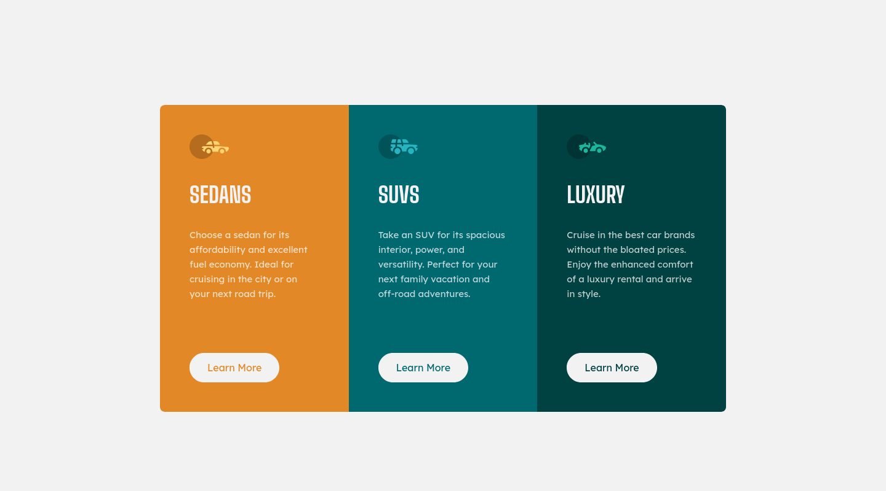

# Frontend Mentor - 3-Column Preview Card Component

This is a solution to the [3-column preview card component challenge on Frontend Mentor](https://www.frontendmentor.io/challenges/3column-preview-card-component-pH92eAR2-). This project demonstrates responsive design, semantic HTML, and accessibility best practices.

## Table of Contents

- [Overview](#overview)
  - [The Challenge](#the-challenge)
  - [Screenshot](#screenshot)
  - [Links](#links)
- [My Process](#my-process)
  - [Built With](#built-with)
  - [What I Learned](#what-i-learned)

## Overview

### The Challenge

Users should be able to:

- View the optimal layout depending on their device's screen size.
- See hover and focus states for interactive elements.
- Access content using keyboard navigation (accessibility).
- Understand card content with semantic HTML and proper ARIA labeling.

### Screenshot



### Links

- Solution URL: [Your Solution URL](https://your-solution-url.com)  
- Live Site URL: [Live Demo](https://your-live-site-url.com)  

## My Process

### Built With

- Semantic HTML5
- CSS Custom Properties
- CSS Grid & Flexbox
- Mobile-first workflow
- Accessibility best practices (ARIA, focus states)

### What I Learned

- How to create a fully responsive 3-column layout using CSS Grid.  
- Using CSS custom properties (`--background`) for dynamic theming.  
- Handling hover and focus-visible states for buttons.  

Example snippet for accessible card:

```html
<article class="card card--first" aria-labelledby="SedansTitle">
  
  <h2 id="SedansTitle" class="card__title">Sedans</h2>
  <p class="card__description">
    Choose a sedan for its affordability and excellent fuel economy.
  </p>
  <a href="#" class="card__button">Learn More</a>
</article>