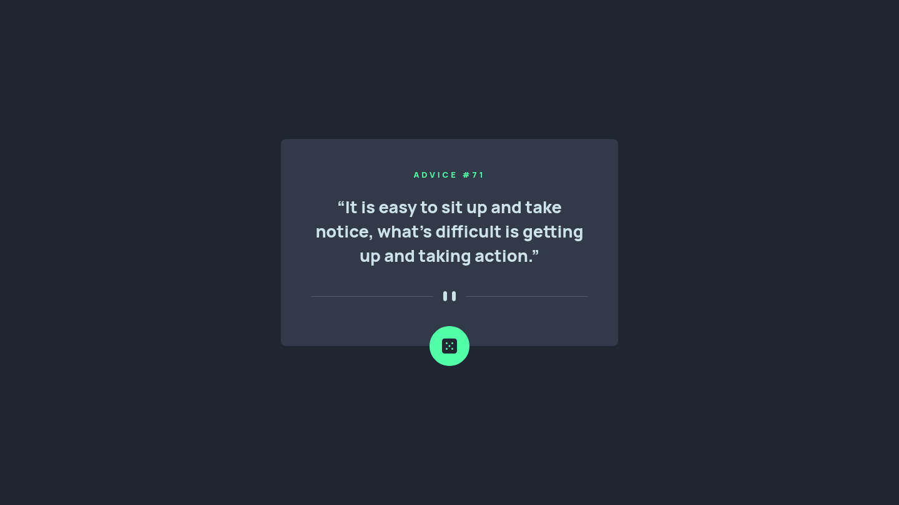

Here’s a clean, professional `README.md` tailored specifically to your project (no unnecessary placeholders or React/Next.js references since your app is vanilla HTML/CSS/JS):

---

# Frontend Mentor - Advice Generator App Solution

This is my solution to the [Advice Generator App challenge on Frontend Mentor](https://www.frontendmentor.io/challenges/advice-generator-app-QdUG-13db). The app fetches and displays random advice from an external API with a smooth and responsive UI.

---

## Overview

### The Challenge

Users should be able to:

* View the optimal layout depending on their device's screen size
* See hover and focus states for interactive elements
* Generate a new piece of advice by clicking the dice button
* See loading and error states when fetching data

---

### Screenshot



---

### Links

* **Solution URL:** [https://your-solution-url.com](https://your-solution-url.com)
* **Live Site URL:** [https://your-live-site-url.com](https://your-live-site-url.com)

---

## My Process

### Built With

* Semantic HTML5
* CSS custom properties
* Flexbox
* Mobile-first workflow
* Vanilla JavaScript (ES6+)
* Fetch API

---

### What I Learned

While building this project, I improved my understanding of:

* **Handling asynchronous API requests**
* **Error handling in JavaScript**
* **UI state management (loading, success, error)**

Example of the fetch logic I implemented:

```js
async function loadAdvice() {
  try {
    displayLoader(true);

    const response = await fetch(API_URL, { cache: 'no-cache' });

    if (!response.ok) {
      throw new Error('HTTP_ERROR');
    }

    const result = await response.json();

    if (!result?.slip) {
      throw new Error('INVALID_DATA');
    }

    displayError(false);
    updateAdvice(result.slip);

  } catch (error) {
    displayError(true, 'Something went wrong. Please try again.');
  } finally {
    displayLoader(false);
  }
}
```

I also learned how to:

* Prevent cached API responses using `{ cache: 'no-cache' }`
* Create a custom loader animation using pure CSS
* Improve accessibility using ARIA roles and live regions

---

### Continued Development

In future projects, I plan to focus on:

* Improving accessibility (ARIA and screen reader behavior)
* Adding animations with better performance
* Structuring JavaScript for scalability (modular patterns)
* Writing cleaner and reusable UI components

---

### Useful Resources

* [https://developer.mozilla.org/en-US/docs/Web/API/Fetch_API](https://developer.mozilla.org/en-US/docs/Web/API/Fetch_API) – Helped me understand fetch and error handling
* [https://css-tricks.com/](https://css-tricks.com/) – Great resource for layout and animation techniques

---

## Author

* Frontend Mentor – [https://www.frontendmentor.io/profile/aydn2026](https://www.frontendmentor.io/profile/aydn2026)
* GitHub – [https://github.com/aydn2026](https://github.com/aydn2026)
* Twitter – [https://x.com/aydn2026](https://x.com/aydn2026)

---

## Acknowledgments

Thanks to the Frontend Mentor community for inspiration and shared solutions that helped me refine my approach.

---

If you want, I can also:

* Generate a **better project description for your portfolio**
* Suggest **improvements to impress reviewers**
* Or help you **deploy it (Netlify / Vercel / GitHub Pages)**
